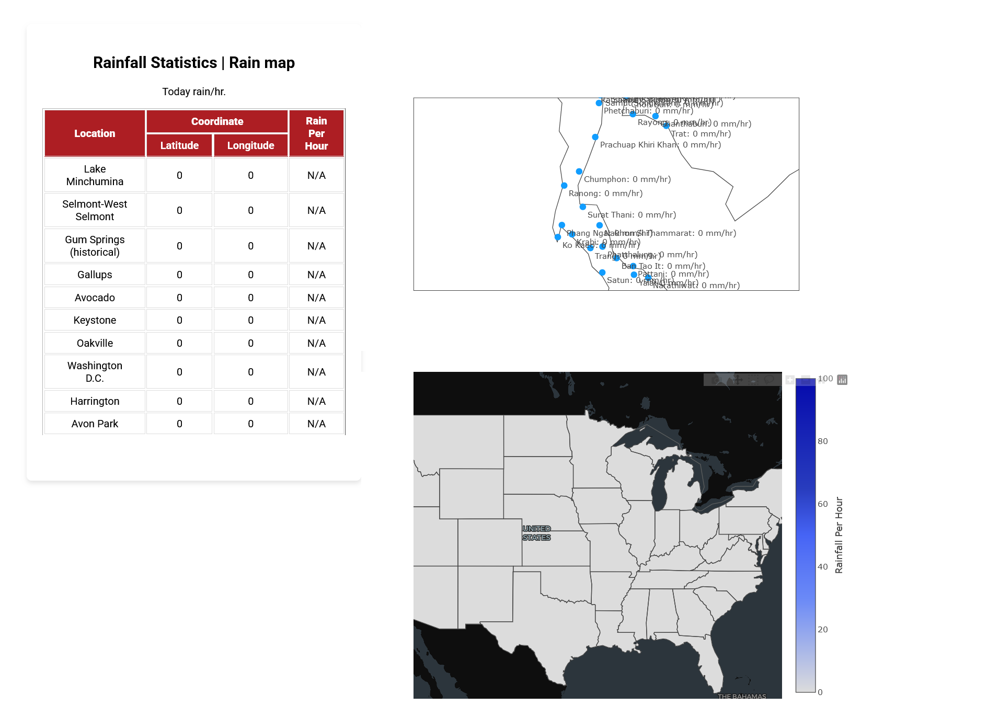
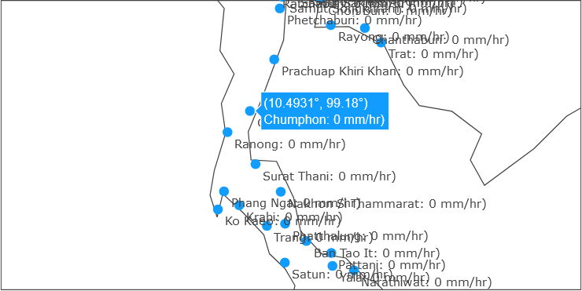
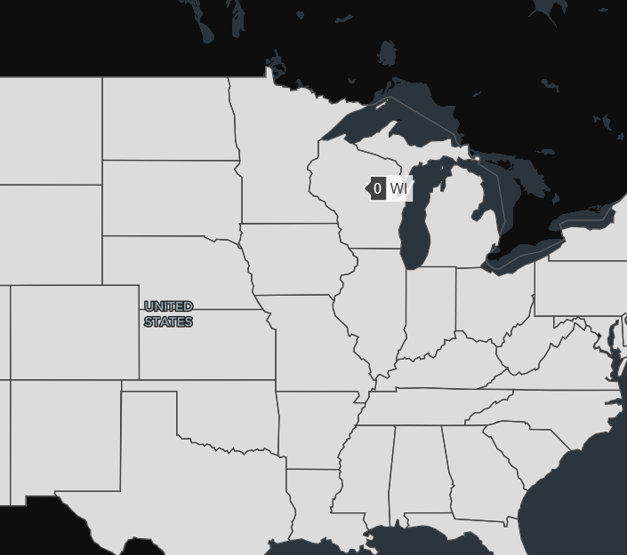

# Create Report, where does it rain?

## Usage

**Requirement**
- [Docker](https://www.docker.com/products/docker-desktop/)
- [Openweather](https://openweathermap.org/) API Key


1. Go to `docker-compose.yml` and fill Openweathermap API Key

2. Run compose up

```bash
docker compose up --build --remove-orphans --force-recreate
```

Then, go to [http://localhost:8080/report/](http://localhost:8080/report/)

---

Manually run each service

- Run Go server
```bash
cd cmd
go mod download
go run main.go
```

- Run http server
```bash
cd nginx/web
python -m http.server 8000
```
Then, go to [http://localhost:8000/](http://localhost:8000/)


## Report example




